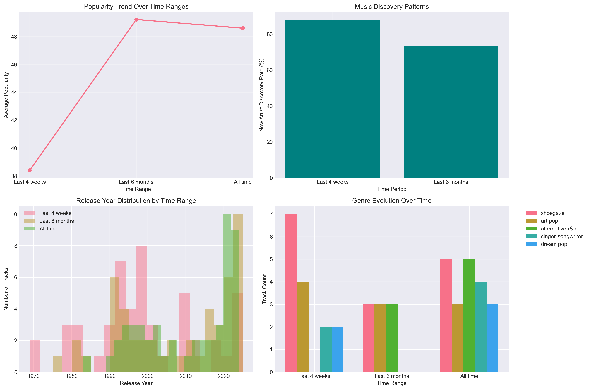

# Spotify Music Analytics Platform

## Overview
Analyzes Spotify listening history to identify music taste clusters, calculate diversity scores, and visualize how preferences change over time through automated data pipelines and interactive dashboards
## Features
- **Machine Learning**: K-means clustering with PCA to identify music taste patterns
- **Statistical Analysis**: Diversity metrics, temporal patterns, evolution tracking
- **Data Engineering**: ETL pipeline processing 150+ tracks
- **Visualizations**: Interactive Plotly dashboards and static matplotlib plots
- **Clean Architecture**: OOP design with comprehensive error handling

## Sample Insights
- Music diversity score: 0.983 (Simpson's Index)
- 8 distinct listening clusters identified
- Peak listening hours: 9 PM - 11 PM
- 87.9% monthly new artist discovery rate

## Tech Stack
- **Languages**: Python 3.9+
- **Data Processing**: Pandas, NumPy
- **ML/Statistics**: Scikit-learn, SciPy
- **Visualization**: Plotly, Matplotlib, Seaborn
- **API**: Spotipy
- **Testing**: Pytest

## Project Structure
```
spotify-analytics/
├── src/                    # Core analysis modules
│   ├── __init__.py        # Package initialization
│   ├── analyzer.py        # Main analytics engine
│   ├── config.py          # Configuration management
│   ├── utils.py           # Helper functions
│   └── visualizations.py  # Visualization functions
├── tests/                  # Unit tests
│   └── test_analyzer.py
├── images/                 # README screenshots
│   ├── dashboard.png
│   ├── clusters.png
│   ├── evolution.png
│   └── temporal_analysis.png
├── notebooks/              # Jupyter notebooks
│   └── exploration.ipynb
├── .env.example           # Environment template
├── .gitignore             # Git ignore rules
├── README.md              # Project documentation
├── requirements.txt       # Python dependencies
├── setup.py              # Package setup
└── run_analysis.py        # Main entry point
```

## Prerequisites
- Python 3.8 or higher
- Spotify Developer Account
- Spotify Premium (recommended for full features)

## Installation

1. Clone the repository:
```bash
git clone https://github.com/alexvarivo/spotify-analytics.git
cd spotify-analytics
```

2. Install dependencies:
```bash
pip install -r requirements.txt
```

3. Set up Spotify API credentials:
   - Go to https://developer.spotify.com/dashboard
   - Create a new app
   - Copy your Client ID and Client Secret
   
4. Configure environment variables:
```bash
cp .env.example .env
# Edit .env with your credentials
```

## Usage

Run the analysis:
```bash
python run_analysis.py
```

For verbose output:
```bash
python run_analysis.py --verbose
```

## Output

The analysis generates:
- `/data/` - Raw and processed CSV files
- `/visualizations/` - Interactive HTML dashboards and PNG plots
- `spotify_analytics_report.md` - Comprehensive markdown report

## Testing

Run tests:
```bash
pytest tests/
```

## Sample Visualizations

### Dashboard Overview


### Music Clustering Analysis


### Temporal Listening Patterns


### Taste Evolution Charts

## Methodology

### Clustering Analysis
- Feature engineering from track metadata
- StandardScaler normalization
- PCA for dimensionality reduction
- K-means with silhouette score optimization

### Diversity Metrics
- Simpson's Diversity Index for artist variety
- Genre distribution analysis
- Temporal spread calculations

### Machine Learning Pipeline
- Engineered 15+ features from Spotify API data
- Applied PCA achieving 79.4% variance explained
- Optimized K-means (k=2-10) using silhouette analysis

## Contributing

Contributions are welcome! Please feel free to submit a Pull Request.

## License

This project is licensed under the MIT License - see the LICENSE file for details.

## Author

**Alex Varivoda**
- GitHub: [@alexvarivo](https://github.com/alexvarivo)
- LinkedIn: [Alex Varivoda](https://linkedin.com/in/alexvarivoda)

## Acknowledgments

- [Spotify Web API](https://developer.spotify.com/documentation/web-api/) for providing comprehensive music data access
- [Spotipy](https://github.com/spotipy-dev/spotipy) - Lightweight Python library for the Spotify Web API
- [Pandas](https://pandas.pydata.org/) development team for data manipulation tools
- [Scikit-learn](https://scikit-learn.org/) contributors for machine learning algorithms
- [Plotly](https://plotly.com/) for interactive visualization capabilities
- [Matplotlib](https://matplotlib.org/) and [Seaborn](https://seaborn.pydata.org/) for statistical graphics